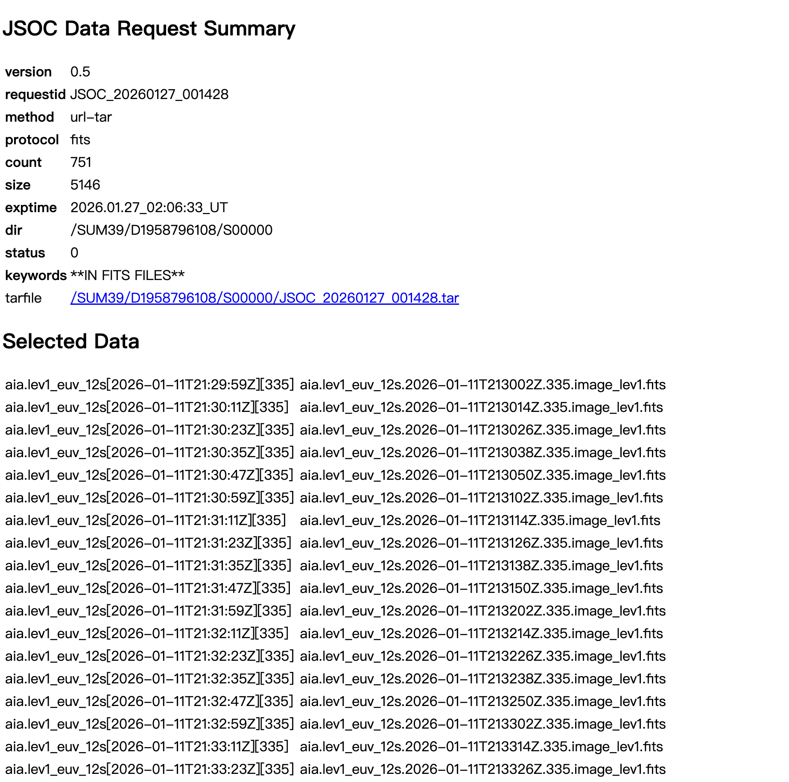

+++
title = "AIA Data Process: Note"
date = "2026-01-26T17:12:00"
slug = "aia-data-processing"
description = "AIA 数据常用处理操作笔记：JSOC 数据下载流程与快视图 PNG / MP4 批处理脚本。"
tags = ["太阳物理", "SDO/AIA", "数据处理"]
math = false
draft = false
+++

# Data downloads
1. 进入 JSOC 网站 [http://jsoc.stanford.edu/ajax/exportdata.html?ds=aia.lev1_euv_12s](http://jsoc.stanford.edu/ajax/exportdata.html?ds=aia.lev1_euv_12s)
2. 在 RecordSet 处输入起始时间和需要的波长，格式为
```text
aia.lev1_euv_12s[start_time-endtime][wavelength1,wavelength2,…]{image}
eg. aia.lev1_euv_12s[2026-01-11T21:30:00Z-2026-01-12T00:00:00Z][211,335]{image}
```
3. 点击 Record Count 计数文件数，以确认输入格式是否正确
4. Method 选 url-tar 以便服务器等 wget 下载
5. Notify 输入邮箱后，点击 check parameters 等待检查，然后点击 submit 提交
6. RequestID 生成后，点击 Submit Status Request 等待请求发送至邮箱

7. 邮箱收到链接后进入链接

复制 tarfile 的链接，终端进入存储文件夹，使用 wget 命令下载
```bash
wget -c --tries=0 --timeout=30 \
  targetfile_link
```
8. 下载完成后，解压到文件夹即可
```bash
tar -xvf JSOC_file.tar
```
# AIA quicklook process
AIA 数据下载完成后，一般先生成块视图片/视频方便对时间进行初步了解
## PNG mk
```python
import os, glob
import numpy as np
from sunpy.map import Map
import astropy.units as u

# 强制无显示后端（集群上很重要）
import matplotlib
matplotlib.use("Agg")
import matplotlib.pyplot as plt
from matplotlib import colors as mcolors

from concurrent.futures import ProcessPoolExecutor, as_completed
import time

plt.rcParams.update({'font.size': 14})

target_wavelengths = [94, 131, 171, 193, 211, 304, 335]
date_str = "20260111"
fits_dir = f"/share/home/sunr/solar_data/data_sunr/aia_fits/{date_str}" # AIA fits 存储文件夹
out_base = "/share/home/sunr/Documents/Corona/cme_three_sturctrue/aia_ql" # 快视图片输出文件夹
diff_lag = 20 # 差分时间，20 张对应 4 min

def make_png_for_wavelength(wl: int):
    wl = str(wl)
    pattern = os.path.join(fits_dir, f"aia.lev1_euv_12s.*.{wl}.image_lev1.fits")
    aia_files = sorted(glob.glob(pattern))

    print(f"[{wl}] files = {len(aia_files)}", flush=True)
    if len(aia_files) <= diff_lag:
        print(f"[{wl}] Not enough files: {len(aia_files)} <= {diff_lag}", flush=True)
        return

    save_dir = os.path.join(out_base, wl)
    os.makedirs(save_dir, exist_ok=True)

    t0 = time.time()
    produced = 0

    for i in range(diff_lag, len(aia_files)):
        try:
            m = Map(aia_files[i])
            m0 = Map(aia_files[i - diff_lag])

            data = (m.data.astype(np.float32) / m.exposure_time.to_value(u.s))
            data0 = (m0.data.astype(np.float32) / m0.exposure_time.to_value(u.s))
            diff = data - data0

            vmin = max(np.nanpercentile(data, 1), 1.0)
            vmax = np.nanpercentile(data, 99.9)
            data_clip = np.clip(data, vmin, vmax)

            diff_clip = diff.copy()
            diff_clip[diff_clip < 0.1] = 0.1

            m_norm = Map((data_clip, m.meta))
            m_norm.plot_settings["norm"] = mcolors.LogNorm()
            m_diff = Map((diff_clip, m.meta))

            fig = plt.figure(figsize=(12, 6))
            ax1 = fig.add_subplot(1, 2, 1, projection=m_norm)
            m_norm.plot(axes=ax1, clip_interval=(1, 99.9) * u.percent, interpolation="antialiased")
            ax1.grid(False)

            ax2 = fig.add_subplot(1, 2, 2, projection=m_diff)
            m_diff.plot(axes=ax2, clip_interval=(1, 99.9) * u.percent, interpolation="antialiased")
            ax2.grid(False)

            plt.tight_layout()
            filename = f"aia{wl}_{m.date.strftime('%H:%M:%S')}_ql.png"
            out_path = os.path.join(save_dir, filename)
            fig.savefig(out_path, dpi=150)
            plt.close(fig)

            produced += 1

            # 每 20 张汇报一次进度（你可改更频繁）
            if produced % 20 == 0:
                dt = time.time() - t0
                print(f"[{wl}] produced={produced}, i={i}/{len(aia_files)-1}, elapsed={dt:.1f}s", flush=True)

        except Exception as e:
            print(f"[{wl}] ERROR at i={i}: {aia_files[i]} -> {repr(e)}", flush=True)
            continue

    print(f"[{wl}] Done. Total produced={produced}. Output={save_dir}", flush=True)

def main():
    # 进程数别太大，避免 I/O 打爆；一般 3~5 就很好
    max_workers = min(len(target_wavelengths), 10)

    with ProcessPoolExecutor(max_workers=max_workers) as ex:
        futures = [ex.submit(make_png_for_wavelength, wl) for wl in target_wavelengths]
        for fut in as_completed(futures):
            fut.result()

    print("All wavelengths done.", flush=True)

if __name__ == "__main__":
    main()

```
## MP4 mk
在生成 png 后可以生成视频，保存到本地方便查看
```python
import imageio.v2 as imageio
import glob
import os
from concurrent.futures import ThreadPoolExecutor
import threading

def create_video_for_wavelength(target_wavelength):
    """为单个波长创建MP4视频"""
    print(f"开始处理波长: {target_wavelength}")
    
    # 构建该波长的目录路径
    png_dir = f'/share/home/sunr/Documents/Corona/cme_three_sturctrue/aia_ql/{target_wavelength}' # 上一步生成的 png 快视图片存储位置
    
    # 检查目录是否存在
    if not os.path.exists(png_dir):
        print(f"警告: 目录不存在 {png_dir}")
        return
    
    # 获取并排序所有PNG文件
    png_files = glob.glob(os.path.join(png_dir, '*.png'))
    png_files.sort()  # 确保按时间顺序排列
    
    if not png_files:
        print(f"警告: 在 {png_dir} 中未找到PNG文件")
        return
    
    # 生成MP4
    output_dir = '/share/home/sunr/Documents/Corona/cme_three_sturctrue/aia_ql/video' # mp4 输出目录
    os.makedirs(output_dir, exist_ok=True)  # 确保输出目录存在
    
    output_mp4 = os.path.join(output_dir, f'aia_{target_wavelength}_ql.mp4')

    try:
        # 使用ffmpeg格式创建MP4
        with imageio.get_writer(output_mp4, format='FFMPEG', fps=20) as writer:
            for png_file in png_files:
                image = imageio.imread(png_file)
                writer.append_data(image)

        # 计算帧数和文件大小
        num_frames = len(png_files)
        file_size_mb = os.path.getsize(output_mp4) / (1024 * 1024)  # 转换为MB

        print(f"[{target_wavelength}A] 已保存至: {output_mp4}")
        print(f"[{target_wavelength}A] 共 {num_frames} 帧, 总大小: {file_size_mb:.2f} MB")
        
    except Exception as e:
        print(f"错误: 处理波长 {target_wavelength} 时发生异常: {str(e)}")

# 1. 获取所有波长
target_wavelengths = [94, 131, 171, 193, 211, 304, 335]

print(f"开始处理 {len(target_wavelengths)} 个波长: {target_wavelengths}")

# 使用多线程处理（限制线程数以避免资源耗尽）
max_workers = min(10, len(target_wavelengths))  # 根据实际情况调整，避免同时开启过多进程
with ThreadPoolExecutor(max_workers=max_workers) as executor:
    # 提交所有任务
    futures = [executor.submit(create_video_for_wavelength, wl) for wl in target_wavelengths]
    
    # 等待所有任务完成
    for future in futures:
        future.result()

print("所有视频生成完成！")
```
