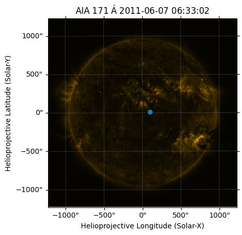

+++
title = "Sunpy Basic 学习记录"
date = "2024-11-27T21:00:00"
slug = "sunpy_basic"
description = "SunPy 入门学习记录：环境安装与太阳数据处理的踩坑笔记。"
tags = ["SunPy", "Python"]
math = true
draft = false
+++

这是一个Sunpy基础的学习文档，来自于官方文档
 [https://docs.sunpy.org/en/stable/tutorial/index.html](https://docs.sunpy.org/en/stable/tutorial/index.html)

# Units

Sunpy中的单位知识
 [https://docs.sunpy.org/en/stable/tutorial/units.html](https://docs.sunpy.org/en/stable/tutorial/units.html)

## Adding units to data

为数据添加单位，通过数字*单位创建一个带单位的变量。

```python
import astropy.units as u
length = 10 * u.meter
length
```

$10\; \mathrm{m}$

变量length具有float数值（value）和单位（unit）两部分

```text
length.value
```

```python
np.float64(10.0)
```

```text
length.unit
```

$\mathrm{m}$

## Arithmetic With Units

带单位的计算

```python
distance_start = 10 * u.mm
distance_end = 23 * u.km
displacement = distance_end - distance_start
displacement
```

$22.99999\; \mathrm{km}$

```python
time = 15 * u.minute
speed = displacement / time
speed
```

$1.5333327\; \mathrm{\frac{km}{min}}$

可见 `astropy.unit` 能自动对单位进行换算与量纲的计。与此同时，不同单位间的错误计算会被报错。

## Converting Units

单位转换

```python
length.to(u.km)
```

$0.01\; \mathrm{km}$

```text
length.cgs # cgs为厘米-克-秒下的单位
```

$1000\; \mathrm{cm}$

## Unit Equivalencies

如在公式$E=hc/\lambda$中，能量（keV）与波长（m）是等效的，但直接进行单位转化会报错。然而，我们可以使用光谱等效性来执行这种转换：

```python
length.to(u.keV, equivalencies=u.spectral())
```

$1.239842 \times 10^{-10}\; \mathrm{keV}$

在太阳物理学中常见的一种等效关系是将天空平面中的角距离（arcsec）转换为太阳上的实际距离。要进行这种转换，sunpy 提供了  `solar_angle_equivalency` ，这需要指定测量该角距离的位置：

```python
from sunpy.coordinates import get_earth
from sunpy.coordinates.utils import solar_angle_equivalency

length.to(u.arcsec, equivalencies=solar_angle_equivalency(get_earth("2013-10-28")))#2013-10-28时太阳到地球的距离
```

```text
INFO: Apparent body location accounts for 495.82 seconds of light travel time [sunpy.coordinates.ephemeris]
```

$1.3876375 \times 10^{-5}\mathrm{arcsec}$

## Dropping Units

不需要单位时，可以去掉单位

```python
length.to_value()
```

```python
np.float64(10.0)
```

```python
length.to_value(u.km)
```

```python
np.float64(0.01)
```

## Quantities as function arguments

当调用一个依赖于与物理量相对应的输入的函数时，通常隐含着一个假设，即这些输入参数是以该函数预期的单位表示的。例如，如果我们像上面那样定义一个计算速度的函数，输入应该对应于距离和时间：

```python
def speed(length, time):
    return length / time
```

然而，这是假设传入的两个参数在没有进行检查的情况下具有与距离和时间一致的单位。 `quantity_input` 装饰器与函数注释结合使用，对函数输入强制执行兼容的单位：

```python
@u.quantity_input # 用于检测输入参数的单位是否正确
def speed(length: u.m, time: u.s):
    return length / time
```

```python
speed(1*u.m, 1*u.minute)
```

$1\; \mathrm{\frac{m}{min}}$

注意到，输出的单位取决于输入的单位。为了确保函数的输出具有一致的单位，可以添加了一个额外的函数注释，以便在返回答案之前始终将输出强制转换为米/秒。

```python
@u.quantity_input
def speed(length: u.m, time: u.s) -> u.m/u.s:
    return length / time
speed(1*u.m, 1*u.minute)
```

$0.016666667\; \mathrm{\frac{m}{s}}$

# Times

Sunpy中有关时间的基本知识 [https://docs.sunpy.org/en/stable/tutorial/time.html](https://docs.sunpy.org/en/stable/tutorial/time.html)

## Parsing Times

太阳数据与许多不同的时间格式相关联。为了处理所有这些格式，sunpy有 `sunpy.time.parse_time()` ，它接受各种输入，并返回一致的 Time 对象。注意， `datetime.datetime.datetime` 不提供对太阳物理学中使用的常见时间格式或闰秒的支持，因此在 sunpy 中始终使用  `astropy.time.Time` 。

```python
from sunpy.time import parse_time

parse_time('2007-05-04T21:08:12')
```

```text
<Time object: scale='utc' format='isot' value=2007-05-04T21:08:12.000>
```

```python
parse_time(894316092.00000000, format='utime')
```

```text
<Time object: scale='utc' format='utime' value=894316092.0>
```

## Time Ranges

数据分析中的另一项标准任务是处理时间对或时间范围。为了处理时间范围，sunpy 提供了 `sunpy.time.TimeRange` 对象。可以通过提供开始时间和结束时间来创建一个 `sunpy.time.TimeRange` 对象：

```text
from sunpy.time import TimeRange

time_range = TimeRange('2010/03/04 00:10', '2010/03/04 00:20')
```

`TimeRange` 使用了 `sunpy.time.parse_time()` ，所以它可以接受多种时间格式。或者，也可以指定一个开始时间和一个持续时间：

```python
time_range = TimeRange('2010/03/04 00:10', 400 * u.second)
```

`TimeRange` 提供了许多有用的函数。例如，可以轻松地获取间隔中心的时间或间隔的长度：

```text
time_range.center # TimeRange的中间时刻
```

```text
<Time object: scale='utc' format='isot' value=2010-03-04T00:13:20.000>
```

```text
time_range.seconds # TimeRange的持续时间
```

$400\; \mathrm{s}$

`TimeRange` 也可以很容易地拆分为等长的子区间，例如将一个 `TimeRange` 对象拆分为两个新的 `TimeRange` 对象。

```python
time_range.split(2)
```

```text
[   <sunpy.time.timerange.TimeRange object at 0x12443bdf0>
     Start: 2010-03-04 00:10:00
     End:   2010-03-04 00:13:20
     Center:2010-03-04 00:11:40
     Duration:0.002314814814814825 days or
            0.0555555555555558 hours or
            3.333333333333348 minutes or
            200.00000000000088 seconds,
    <sunpy.time.timerange.TimeRange object at 0x12443a8b0>
     Start: 2010-03-04 00:13:20
     End:   2010-03-04 00:16:40
     Center:2010-03-04 00:15:00
     Duration:0.002314814814814825 days or
            0.0555555555555558 hours or
            3.333333333333348 minutes or
            200.00000000000088 seconds]
```

# Coordinates

Sunpy中的坐标相关知识，参照 [https://docs.sunpy.org/en/stable/tutorial/coordinates.html](https://docs.sunpy.org/en/stable/tutorial/coordinates.html) 。

本指南的这一部分介绍了在 sunpy 中坐标是如何表示的。sunpy 使用了 `astropy.coordinates` 模块来完成这个任务。

就像 `units` 被用于表示物理量一样，sunpy 使用 `astropy.coordinates` 来表示物理空间中的点。这既适用于三维空间中的点，也适用于图像中的投影坐标。

Astropy 的坐标模块主要通过 `SkyCoord` 类来使用，该类也使用了 Astropy 的单位体系。

```python
from astropy.coordinates import SkyCoord
import astropy.units as u
from sunpy.coordinates import frames # 导入sunpy中太阳使用的坐标系

coord = SkyCoord(70*u.deg, -30*u.deg, obstime="2017-08-01",
                 frame=frames.HeliographicStonyhurst)
coord
```

```text
<SkyCoord (HeliographicStonyhurst: obstime=2017-08-01T00:00:00.000, rsun=695700.0 km): (lon, lat) in deg
    (70., -30.)>
```

这个 `SkyCoord` 对象随后可以转换为在 Astropy 或 sunpy 中定义的任何其他坐标框架，例如将原始的斯通尼赫斯特框架（天球中的赤经/赤纬坐标系）转换为日心投影框架：

```python
coord.transform_to(frames.Helioprojective(observer="earth")) # 转换为日面投影坐标arcsec
```

```text
<SkyCoord (Helioprojective: obstime=2017-08-01T00:00:00.000, rsun=695700.0 km, observer=<HeliographicStonyhurst Coordinate for 'earth'>): (Tx, Ty, distance) in (arcsec, arcsec, km)
    (769.96270814, -498.89715922, 1.51668773e+08)>
```

在实际使用中，使用数组坐标进行操作更加方便

```python
coord = SkyCoord([-500, 400]*u.arcsec, [100, 200]*u.arcsec, frame=frames.Helioprojective)
coord
```

```text
<SkyCoord (Helioprojective: obstime=None, rsun=695700.0 km, observer=None): (Tx, Ty) in arcsec
    [(-500., 100.), ( 400., 200.)]>
```

```text
coord[0]
```

```text
<SkyCoord (Helioprojective: obstime=None, rsun=695700.0 km, observer=None): (Tx, Ty) in arcsec
    (-500., 100.)>
```

## Observer Location

“日心投影”（Helioprojective）和“日心”（Heliocentric）坐标系都是基于观测者的位置来定义的。因此，要将这两个坐标系中的任意一个转换为另一个坐标系，必须知道观测者的位置。可以使用 `SkyCoord` 的 `observer` 参数为坐标对象指定观测者。对于sunpy来说，要计算地球或其他太阳系天体的位置，必须知道与坐标相关的时间；这是通过 `obstime` 参数指定的。

利用观测者位置，可以将一个观测者看到的坐标转换为另一个观测者看到的坐标：

```python
hpc = SkyCoord(0*u.arcsec, 0*u.arcsec, observer="earth",
                obstime="2017-07-26",
                frame=frames.Helioprojective)

hpc.transform_to(frames.Helioprojective(observer="venus",
                                         obstime="2017-07-26"))
```

```text
<SkyCoord (Helioprojective: obstime=2017-07-26T00:00:00.000, rsun=695700.0 km, observer=<HeliographicStonyhurst Coordinate for 'venus'>): (Tx, Ty, distance) in (arcsec, arcsec, AU)
    (-1285.47497992, 106.20918654, 0.72405937)>
```

## Using Coordinates with Maps

Sunpy 中的 Map 使用坐标来指定图像上的位置，并在地图的绘图上绘制覆盖图。当创建一个地图时，会根据头部信息构建一个坐标框架。可以使用 `.coordinate_frame` 来访问这个坐标框架：

```python
from astropy.coordinates import SkyCoord
import astropy.units as u

import sunpy.map
from sunpy.data.sample import AIA_171_IMAGE

amap = sunpy.map.Map(AIA_171_IMAGE)
amap.coordinate_frame
```

```text
<Helioprojective Frame (obstime=2011-06-07T06:33:02.880, rsun=696000.0 km, observer=<HeliographicStonyhurst Coordinate (obstime=2011-06-07T06:33:02.880, rsun=696000.0 km): (lon, lat, radius) in (deg, deg, m)
    (-0.00406429, 0.04787238, 1.51846026e+11)>)>
```

这可以在创建一个 `SkyCoord` 对象时使用，以将坐标系设置为该图像的坐标系：

```python
coord = SkyCoord(100 * u.arcsec, 10*u.arcsec, frame=amap.coordinate_frame)
coord
```

```text
<SkyCoord (Helioprojective: obstime=2011-06-07T06:33:02.880, rsun=696000.0 km, observer=<HeliographicStonyhurst Coordinate (obstime=2011-06-07T06:33:02.880, rsun=696000.0 km): (lon, lat, radius) in (deg, deg, m)
    (-0.00406429, 0.04787238, 1.51846026e+11)>): (Tx, Ty) in arcsec
    (100., 10.)>
```

`SkyCoord` 对象可以使用 `GenericMap.wcs.world_to_pixel` 转换为一对像素：

```text
pixels = amap.wcs.world_to_pixel(coord)
pixels
```

```text
(array(551.7680511), array(515.18266871))
```

这个 `SkyCoord` 对象也可以用于在地图上绘制一个点：

```python
import matplotlib.pyplot as plt

fig = plt.figure()
ax = plt.subplot(projection=amap)
amap.plot()
ax.plot_coord(coord, 'o')
```

```text
[<matplotlib.lines.Line2D at 0x1254ade50>]
```


